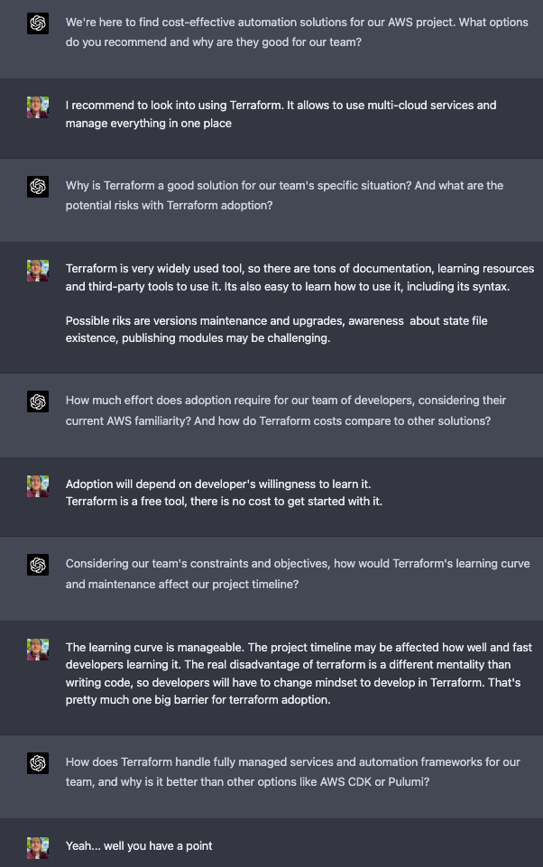

# About Victor

Victor is a seasoned team leader looking for the best automation solution for his team that develops complex applications in AWS. He needs your help!

Victor isn't talkative, and he loves listening to new ideas and asking questions. As a business-oriented person, he needs to know the benefits and drawbacks of each technical solution.

# Victor's sparring partner

That would be you :)

Use your expertise to suggest specific solutions that fit his team's needs and explain the risks, value, and constraints of each option.

# How to use

Insert the prompt into ChatGpt, and start engaging with Victor.

You'll be surprised at how much you'll learn and how valuable your insights can be.

Please note that a minimum version of ChatGpt 4 is required for the best experience. In previous versions, the conversation may become repetitive and the questions too similar.

Give it a try and impress Victor with your automation skills today!

# Sample

